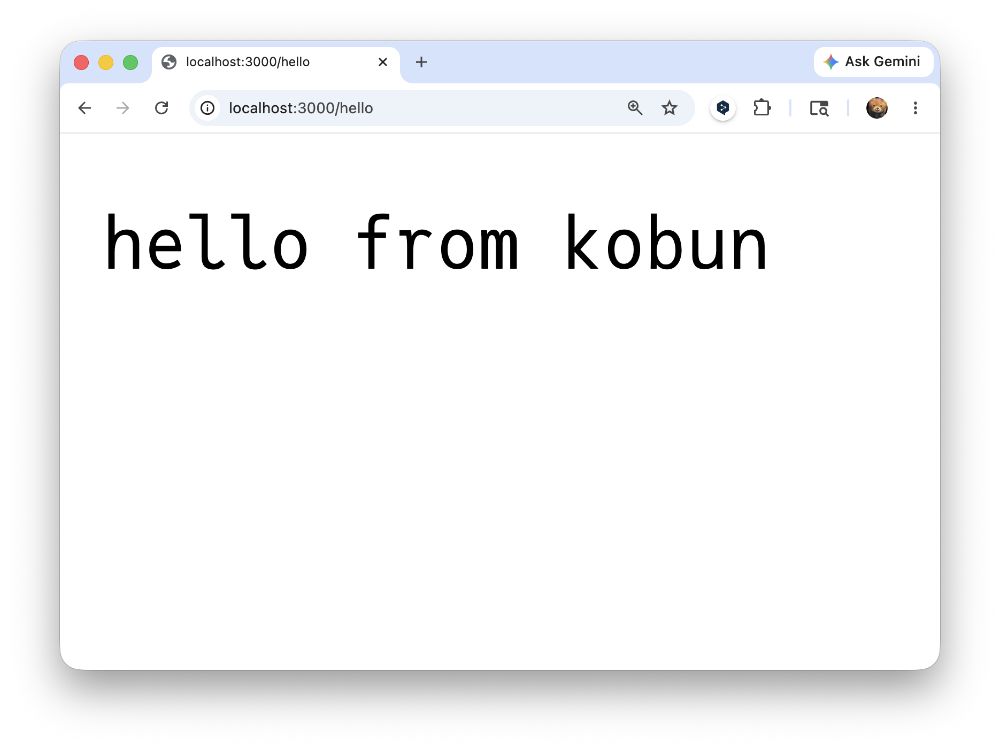

## KoBun

KoBun is a tiny JavaScript runtime written in ~1k lines of C without libuv.

```js
const server = Kobun.serve({
  port: 3000,

  fetch(req) {
    console.log(req.method, req.path);

    if (req.path === "/hello") {
      return new Response("hello from kobun\n", {
        headers: {
          "content-type": "text/plain",
          "x-kobun-path": req.path,
        },
      });
    }

    return new Response("not found\n", { status: 404 });
  },
});

console.log("listening", server.hostname, server.port);
```



## References

WIP.
